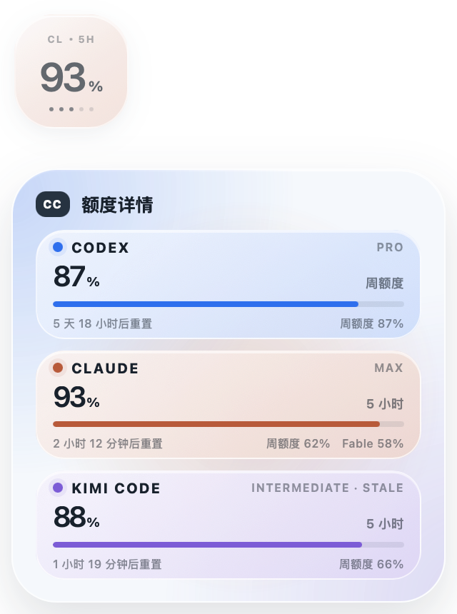

# CC Quota


*Codex, Claude and Kimi Code quota, live in the menu bar. The dots under each capsule count the hours left in the 5-hour window.*

> **macOS only.** There is no Windows or Linux build, and the source does not compile on them:
> frontmost-app detection binds to AppKit, and Claude sign-in is read from the macOS Keychain.
> Releases ship a single universal (Intel + Apple Silicon) macOS app.

CC Quota is a local-first macOS menu bar utility for checking AI coding quota from the sign-in state each tool already keeps on your Mac. Codex, Claude, and Kimi Code are supported today; any one of them alone is enough, and a provider you have not signed into is simply left out rather than shown as an empty capsule.

The name kept its original "**C**odex & **C**laude" reading from the days when those were the only two.

This project is an MIT-licensed adaptation of [change-42-yhmm/quota-float](https://github.com/change-42-yhmm/quota-float). The upstream license, copyright notice, and attribution are retained.

Created and maintained by [Robin0725](https://github.com/Robin0725) (Robin). See [AUTHORS.md](AUTHORS.md) for attribution details.

## CC Quota 0.5.5 highlights

- Wears a monochrome app icon: two white interlocking C's on a near-black shell.
- Freezes the floating widget's display while CC Quota itself is the frontmost app, so clicking the widget to expand the detail panel can no longer switch it to another provider mid-click.
- Adds Kimi Code alongside Codex and Claude, reading the OAuth token its CLI stores locally and querying `api.kimi.com/coding/v1/usages`.
- Treats providers as a registry rather than a fixed pair: a new one is a descriptor and an adapter, and the menu bar, menu, and detail panel pick it up without further changes.
- Shows only the providers you are signed into, sized to however many that is, instead of rendering a fixed pair with empty capsules for the rest.
- Defines each provider's colour once, in Rust, and passes it to the interface, so the tray bitmap and the panel can no longer drift apart.
- Shows every signed-in provider as a compact horizontal quota capsule in the macOS menu bar.
- Enlarges each menu bar capsule to `40 × 17 pt` and scales the centered percentage with it, while staying inside the menu bar's safe visual height.
- Keeps the quota percentage at the exact visual center of each capsule, with five small bottom-edge status dots that never change the number's size or placement.
- Shows the 5-hour reset countdown through those dots: one lit dot equals one remaining started hour, so the last partial hour still shows one dot.
- Clicking the menu bar capsules opens the full CC menu.
- Uses the 5-hour quota whenever that window exists; only a missing 5-hour window falls back to weekly quota and receives a `W` marker.
- Preserves a real 0% 5-hour value instead of incorrectly falling back.
- Keeps the floating window optional and disabled by default.
- Uses a `100 × 100` transparent compact window with one dominant percentage; clicking keeps that trigger in place and opens a `320 × 320` detail panel directly below it, holding one card per signed-in provider.
- Fits three provider cards without scrolling, and scrolls rather than trimming a line when the content grows past the panel.
- Follows the window you click first: when the focused app or its window title names an assistant (terminals title their windows after the running command), the widget switches to it immediately. Reading window titles is optional and needs the macOS Accessibility permission, offered once from the tray menu; titles are matched in memory and never stored or logged.
- Otherwise follows whichever assistant you last typed to, by watching each CLI's prompt-history path — a file only your own input touches, so an agent left grinding in the background cannot pin the widget to itself. Several assistants used from one terminal are told apart correctly, which the frontmost application can never do. Watching is event-driven, so an idle Mac is not polled; the frontmost app remains the fallback when nothing has been active yet.
- Uses tiny `CX / CL / KM` and `5H / W` markers so the single number is never ambiguous.
- Keeps Codex cool blue, Claude warm orange, and Kimi Code violet, with restrained static gradients and no material animation.
- Expands only on click, never on hover, and separates a short click from window dragging with a movement threshold.
- Honors `prefers-reduced-motion` by removing the remaining idle transition.
- Keeps the last good value for up to a day as dimmed stale data and never invents quota when authentication or response formats fail. Every kind of failure is treated the same way, including an expired sign-in, so a card dims rather than disappearing — Kimi's sign-in lapses minutes after its CLI goes idle and renews only when you return, so a shorter window would empty its capsule over lunch.
- Gives each provider a fetch budget, so one provider's gateway holding a request open cannot delay the others' readings.

## Menu bar

CC puts each exact percentage inside its provider-colored capsule, in registry order: Codex cool blue, then Claude warm orange, then Kimi Code violet. Capsules appear only for providers you are signed into, so the status item is as wide as it needs to be and no wider. There are no provider initials or logos in it:

```text
[ 74% ] [ 94% ] [ 99% ]
```

The capsule keeps the menu bar quiet; the menu and tooltip retain the provider name, window type, reset time, and stale-data detail:

```text
Codex · week 42% · 07/20 18:00 reset
```

Time dots appear only for the 5-hour window. When CC has to fall back to weekly quota, it omits the dots instead of pretending that five dots can represent a week; the exact weekly reset remains available in the menu and tooltip.

Open the menu to inspect reset times, refresh immediately, show or hide the floating window, toggle always-on-top, unlock mouse passthrough, switch language, control launch at login, or quit CC.

## Floating window

The floating window is optional and off by default. Enabled, it shows one dominant percentage for whichever assistant you last worked with; clicking it opens the detail panel directly below, one card per signed-in provider, with the exact reset time and the weekly figure alongside the 5-hour one.



*Shown with the interface language set to Chinese; the tray menu switches it.*

## How it works

CC reads the existing Codex Desktop, Claude Code, and Kimi Code login state on the same Mac, then calls each provider's quota service. It does not estimate quota from token counts, redeem reset credits, or modify account settings.

Codex authentication is read from `CODEX_HOME/auth.json` or `~/.codex/auth.json`. Claude Code authentication uses `CLAUDE_CODE_OAUTH_TOKEN` only when the user explicitly set it; otherwise the app reads the macOS Keychain item used by Claude Code, with a local Claude credentials-file fallback. Kimi Code authentication is read from `KIMI_CODE_HOME/credentials` or `~/.kimi-code/credentials`, where only the access token is read: CC never uses the refresh token and never writes that file, leaving the Kimi Code CLI in sole control of its own login. A token that has expired is reported as a failed reading, and the last good numbers stay on screen, dimmed, until the CLI renews it. Credentials are used in memory and are not copied into CC preferences.

To tell which assistant you are working with, CC subscribes to file system events for each CLI's prompt-history path (Codex, lacking one, keeps its session directory) and records **only the moment a change was reported**. It never opens, reads, or indexes those files, and their paths are never logged. This is what lets several assistants in one terminal be told apart, since the frontmost application is the terminal in every case.

Browser preview uses mock data. Real quota reading requires the Tauri desktop app and an existing sign-in for at least one supported provider.

The provider quota endpoints may change. When an authentication method or response shape is no longer recognized, CC shows stale or unavailable state rather than fabricating a number.

## Privacy boundary

- Reads local sign-in state only to request quota.
- Sends each access token only to that provider's quota endpoint.
- Stores only widget preferences in the CC app config directory.
- Watches each CLI's prompt-history path (or session directory where no history file exists) for change events and keeps only the time of the most recent change per provider. It never opens or reads those files, and never records their names or paths.
- Does not store tokens, account IDs, prompts, chat history, raw quota responses, or local auth paths.
- Includes no telemetry, analytics, crash reporting, or third-party tracking.
- Does not redeem reset credits or modify account settings.

See [PRIVACY.md](PRIVACY.md) and [SECURITY.md](SECURITY.md).

## Development

Requirements:

- Node.js 20.19+ or 22.12+
- Rust stable
- Tauri 2 system dependencies

```bash
npm install
npm run test
npm run build
npm run tauri dev
```

The visual preview is available in a browser with `npm run dev`; append `?designer=1` to open the CC design workbench. Use `?designer&mode=compare` for the old-versus-current comparison.

## Build

```bash
npm run tauri build
```

The transparent macOS WebView uses Tauri's `macOSPrivateApi`. Public builds should be distributed directly or through GitHub Releases rather than the Mac App Store.

Do not upload local credentials, `.codex`, `.claude`, `.env*`, personal screenshots, `node_modules`, `dist`, `src-tauri/target`, or local installers.

## License

MIT. See [LICENSE](LICENSE).

CC is an independent project and is not affiliated with or endorsed by OpenAI or Anthropic. Codex, OpenAI, Claude, and Anthropic are trademarks of their respective owners.
