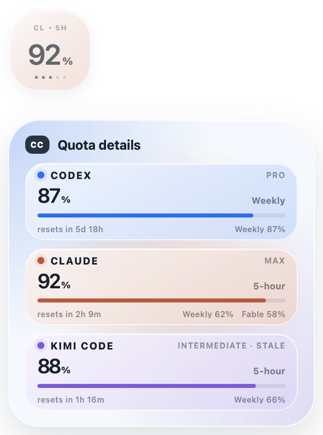
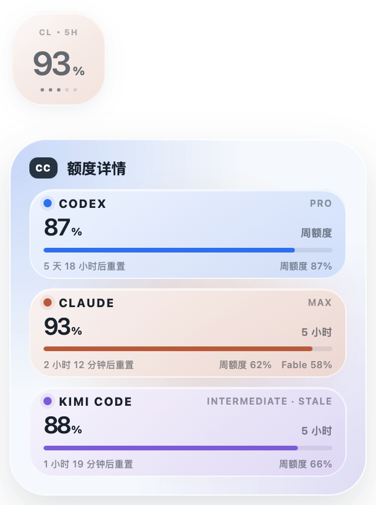

# CC Quota

[English](README.md) · **简体中文**


*Codex、Claude 与 Kimi Code 的额度，实时显示在菜单栏里。每个胶囊下方的圆点表示 5 小时窗口还剩几个小时。*

> **仅限 macOS。** 没有 Windows 或 Linux 版本，源码在这两个平台上也编译不过：
> 前台应用检测依赖 AppKit，Claude 的登录态则要从 macOS 钥匙串里读。
> 发行版提供单一的通用（Intel + Apple Silicon）macOS 应用。

CC Quota 是一个本地优先的 macOS 菜单栏小工具，直接利用各家工具已经存在于你 Mac 上的登录态来查询 AI 编程额度。目前支持 Codex、Claude 和 Kimi Code；只装其中任意一个也能用，没登录过的服务商会直接不显示，而不是给你留一个空胶囊。

这个名字沿用了它最初的含义——"**C**odex & **C**laude" 的两个首字母，那还是只有这两家的年代。

本项目是 [change-42-yhmm/quota-float](https://github.com/change-42-yhmm/quota-float) 的 MIT 许可改编版本，保留了上游的许可证、版权声明与署名信息。

由 [Robin0725](https://github.com/Robin0725)（Robin）创建并维护。署名细节见 [AUTHORS.md](AUTHORS.md)。

## CC Quota 0.5.5 更新亮点

- 换上了单色应用图标：近黑色底上两个交扣的白色 C。
- 当 CC Quota 自己处于前台时，冻结悬浮窗的显示内容，这样点击悬浮窗展开详情面板时，就不会在点击的一瞬间切换到另一个服务商了。
- 在 Codex 和 Claude 之外新增 Kimi Code，读取其 CLI 存在本地的 OAuth token，并查询 `api.kimi.com/coding/v1/usages`。
- 把服务商当作一份注册表来管理，而不是写死的两家：新增一个服务商只需一份描述符加一个适配器，菜单栏、菜单和详情面板无需改动即可自动识别。
- 只显示你已登录的服务商，并按数量自适应宽度，而不是固定渲染两个、其余留空胶囊。
- 每个服务商的配色只在 Rust 里定义一次，再传给界面，托盘位图和面板就再也不会各走各的了。
- 在 macOS 菜单栏里，把每个已登录的服务商显示为一枚紧凑的横向额度胶囊。
- 把菜单栏胶囊放大到 `40 × 17 pt`，居中的百分比也随之放大，同时仍控制在菜单栏的安全视觉高度内。
- 让额度百分比精确停在每个胶囊的视觉正中，底边另有五个小状态点，且永远不会改变数字的大小或位置。
- 用这些圆点表示 5 小时重置倒计时：亮一个点代表还剩一个已开始的小时，所以最后那个不满一小时的零头仍会亮着一个点。
- 点击菜单栏胶囊即可打开完整的 CC 菜单。
- 只要存在 5 小时窗口就优先使用 5 小时额度；只有在没有 5 小时窗口时才回退到周额度，并标注一个 `W` 标记。
- 真实的 0% 5 小时读数会被如实保留，不会被误判为无数据而回退。
- 悬浮窗保持为可选功能，默认关闭。
- 使用一个 `100 × 100` 的透明紧凑窗口，只显示一个主导百分比；点击时该触发窗口原地不动，并在它正下方打开一个 `320 × 320` 的详情面板，每个已登录服务商一张卡片。
- 三张服务商卡片无需滚动即可放下；内容超出面板时选择滚动，而不是把某一行裁掉。
- 跟随你最先点击的那个窗口：当前台应用或其窗口标题指向某个助手时（终端会用正在运行的命令来命名窗口），悬浮窗会立即切过去。读取窗口标题是可选的，需要 macOS 辅助功能权限，托盘菜单会询问一次；标题只在内存中匹配，绝不存储或记录。
- 否则就跟随你最后一次输入的那个助手，办法是监视各 CLI 的提示历史路径——这类文件只有你自己的输入才会碰到，所以一个在后台空转的 agent 没法把悬浮窗钉死在自己身上。同一个终端里用了好几个助手也能正确区分，这是靠前台应用永远做不到的。监视是事件驱动的，Mac 闲置时不会轮询；在还没有任何活动记录时，前台应用仍是兜底方案。
- 用 `CX / CL / KM` 和 `5H / W` 这样的小标记，让那个孤零零的数字永远不会有歧义。
- Codex 保持冷蓝，Claude 保持暖橙，Kimi Code 保持紫罗兰色，配以克制的静态渐变，没有材质动画。
- 只在点击时展开，从不响应悬停，并用一个位移阈值把短促点击和拖动窗口区分开。
- 遵循 `prefers-reduced-motion`，开启后移除剩余的闲置过渡动效。
- 最近一次的有效读数最长保留一天，以变暗的陈旧数据呈现；一旦认证或响应格式出问题，绝不凭空编造额度。所有类型的失败一视同仁，包括登录过期，所以卡片只会变暗而不会消失——Kimi 的登录态在其 CLI 闲置几分钟后就会失效，直到你回来才续期，保留窗口短一点的话，一顿午饭的工夫它的胶囊就空了。
- 给每个服务商单独的请求耗时预算，这样某一家网关把请求挂住时，不会拖慢其他家的读数。

## 菜单栏

CC 把每个精确百分比放进对应服务商配色的胶囊里，按注册表顺序排列：先是 Codex 冷蓝，再是 Claude 暖橙，然后是 Kimi Code 紫罗兰。只有你已登录的服务商才会出现胶囊，所以状态项该多宽就多宽，不会多占一分。里面没有服务商缩写，也没有 logo：

```text
[ 74% ] [ 94% ] [ 99% ]
```

胶囊让菜单栏保持安静；服务商名称、窗口类型、重置时间和陈旧数据的详情，都保留在菜单和悬停提示里：

```text
Codex · week 42% · 07/20 18:00 reset
```

时间圆点只在 5 小时窗口下出现。当 CC 不得不回退到周额度时，它会省略这些圆点，而不是假装五个点能代表一周；精确的周重置时间仍可在菜单和悬停提示中查看。

打开菜单可以查看重置时间、立即刷新、显示或隐藏悬浮窗、切换置顶、解除鼠标穿透、切换语言、控制开机自启，或退出 CC。

## 悬浮窗

悬浮窗是可选的，默认关闭。启用后，它会为你最近使用的那个助手显示一个主导百分比；点击它会在正下方打开详情面板，每个已登录服务商一张卡片，附有精确的重置时间，以及与 5 小时数据并列的周额度数字。

<table>
<tr>
<td></td>
<td></td>
</tr>
<tr>
<td align="center"><em>English</em></td>
<td align="center"><em>简体中文</em></td>
</tr>
</table>

界面提供中英两种语言，在托盘菜单里切换。

## 工作原理

CC 读取同一台 Mac 上已有的 Codex Desktop、Claude Code 和 Kimi Code 登录态，然后调用各服务商的额度服务。它不会用 token 计数去估算额度，不会兑换重置额度，也不会修改账户设置。

Codex 的认证信息读自 `CODEX_HOME/auth.json` 或 `~/.codex/auth.json`。Claude Code 的认证只在用户明确设置了 `CLAUDE_CODE_OAUTH_TOKEN` 时才使用该变量；否则读取 Claude Code 使用的 macOS 钥匙串条目，并以本地 Claude 凭据文件作为兜底。Kimi Code 的认证读自 `KIMI_CODE_HOME/credentials` 或 `~/.kimi-code/credentials`，且只读取其中的 access token：CC 从不使用 refresh token，也从不写入该文件，把登录态的控制权完全留给 Kimi Code CLI 自己。已过期的 token 会被当作一次失败的读取上报，最近一次的有效数字则继续变暗留在屏幕上，直到 CLI 完成续期。凭据只在内存中使用，不会被复制进 CC 的偏好设置。

为了判断你正在使用哪个助手，CC 会订阅各 CLI 提示历史路径的文件系统事件（Codex 没有提示历史文件，改用它的会话目录），并且**只记录变更被报告的那个时刻**。它从不打开、读取或索引这些文件，路径也绝不会被记录。正是这一点让同一个终端里的多个助手能被区分开——因为在这种情况下，前台应用永远都是那个终端。

浏览器预览使用的是模拟数据。真实的额度读取需要 Tauri 桌面应用，并且至少已登录一个受支持的服务商。

各服务商的额度接口可能会变。当某种认证方式或响应结构不再被识别时，CC 会显示陈旧或不可用状态，而不是编一个数字出来。

## 隐私边界

- 只为请求额度而读取本地登录态。
- 每个 access token 只发送给对应服务商的额度接口。
- 只在 CC 应用配置目录中存储悬浮窗偏好设置。
- 监视各 CLI 的提示历史路径（没有历史文件的则监视会话目录）的变更事件，并且每个服务商只保留最近一次变更的时间。它从不打开或读取这些文件，也从不记录它们的名称或路径。
- 不存储 token、账户 ID、提示词、聊天记录、原始额度响应，或本地认证路径。
- 不含任何遥测、统计分析、崩溃上报或第三方追踪。
- 不兑换重置额度，也不修改账户设置。

详见 [PRIVACY.md](PRIVACY.md) 与 [SECURITY.md](SECURITY.md)。

## 开发

环境要求：

- Node.js 20.19+ 或 22.12+
- Rust stable
- Tauri 2 系统依赖

```bash
npm install
npm run test
npm run build
npm run tauri dev
```

用 `npm run dev` 可在浏览器中查看视觉预览；在地址后追加 `?designer=1` 可打开 CC 设计工作台。用 `?designer&mode=compare` 可查看新旧版本对比。

## 构建

```bash
npm run tauri build
```

macOS 的透明 WebView 使用了 Tauri 的 `macOSPrivateApi`。公开构建应直接分发或通过 GitHub Releases 分发，而不是走 Mac App Store。

请勿上传本地凭据、`.codex`、`.claude`、`.env*`、个人截图、`node_modules`、`dist`、`src-tauri/target`，或本地安装包。

## 许可证

MIT。详见 [LICENSE](LICENSE)。

CC 是一个独立项目，与 OpenAI 或 Anthropic 无从属关系，也未获得其背书。Codex、OpenAI、Claude 和 Anthropic 是各自所有者的商标。
